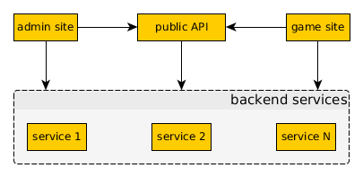

Архитектура
===========

.. contents::
   :local:

По историческим причинам «Сказка» — монолитный проект с сильной связанностью, это начало усложнять реализацию новых фич. Поэтому сейчас он переписывается на микросервисы. Пока идёт активная фаза рефакторинга, сервисы выделяются логически, но не выносятся из основного репозитория (ложаться в соседние каталоги). Когда крупные изменения закончатся, сервисы будут разнесены в разные репозитории.

На этой странице описана архитектура игры, какой она должна стать.

Базовая структура
-----------------

            Стрелками указано использование сервисами друг друга.

Все сервисы игры можно разделить на две группы:

- **frontend** — сервисы, с которыми так или иначе взаимодействуют пользователи.
- **backend** — сервисы, не доступные напрямую для пользователей.

**Frontend** сервисы проверяют права доступа и используют **backend** сервисы для получения данных и инициации изменений.
**Backend** сервисы реализуют специализированные куски логики и не делают неспецифичных проверок (например, не проверяют права доступа).

**Backend** сервисы недоступны извне, доверяют всем клиентам и не реализуют GUI (предоставляют только API).

Коммуникация сервисов происходит через передачу сообщений в формате `Protocol Buffers 3 <https://developers.google.com/protocol-buffers/docs/proto3>`_ по протоколу HTTP.

Существующие сервисы
--------------------

Текущий список сервисов.

- the_tale — сайт игры (сейчас содержит и основную логику);
- tt_diary — хранилище сообщений в дневнике героя;
- tt_market — рынок;
- tt_personal_messages — личные сообщения;
- tt_storage — хранилище предметов игрока (в рамках Сказки, карты судьбы).
- tt_bank — хранилище игровой валюты с поддержкой транзакций.
- tt_timers — управление таймерами (например, на получение карты), по истечении таймера делает заданные http запрос.
- tt_impacts — учёт численных «воздействий» одних сущностей на другие. Например, влияние героев на Мастеров.
- tt_events_log — хранилище истории игровых событий с привязкой к «тегам» и фильтром по ним.
- tt_effects — хранилище эффектов, действующих на объекты игры.
- tt_matchmaker — простой сервис поиска соперника для pvp и отслеживания активных боёв.
- tt_properties — хранилище свойств объектов, нужных в частных случаях логики (например, флаг «разрешить приглашать игрока в клан»).
- tt_uniquer — сервис выделения уникальных целочисленных идентификаторов для строк.

the_tale
~~~~~~~~

Вся функциональность игры: как логика, так и инфраструктура (форум, регистрация, лингквистика, etc).

По мере рефакторинга в этом компоненте останется только сам сайт.

tt_diary
~~~~~~~~

Сервис хранит последние сообщения в дневнике героя и управляет их количеством.

tt_market
~~~~~~~~~

Реализация рынка торговли предметами.

**Не привязан к логике игры, может быть использован отдельно.**

Функциональность:

- выставление предмета на продажу;
- возвращение предмета с продажи;
- покупка предмета;
- получение информации о выставленных предметах;
- получение списка выставленных предметов конкретного типа.
- логирование всех операций.

tt_personal_messages
~~~~~~~~~~~~~~~~~~~~

Личные сообщения игроков.

**Не привязан к логике игры, может быть использован отдельно.**

Функциональность:

- создание сообщений;
- удаление сообщений;
- получение списка сообщений (входящих/исходящих, по фильтру);
- поиск сообщений;

tt_storage
~~~~~~~~~~

Предметы игрока. Используется для хранения карт судьбы.

**Не привязан к логике игры, может быть использован отдельно.**

Функциональность:

- помещение предмета в хранилище;
- удаление предмета из хранилища;
- передача предмета другому игроку;
- перемещение предмета между «карманами» хранилища;
- логирование всех операций.

tt_bank
~~~~~~~

Хранилище игровой валюты с поддержкой транзакций.

**Не привязан к логике игры, может быть использован отдельно.**

Функциональность:

- болучение баланса аккаунта в каждой валюте;
- транзакции: начал, окончание, откат;

tt_timers
~~~~~~~~~

Управление таймерами (например, на получение карты или постройки здания), по истечении таймера делает заданные http запрос.

**Не привязан к логике игры, может быть использован отдельно.**

Функциональность:

- создание таймера с заданными параметрами;
- изменение скорости выполнения таймера;
- http запрос по истечению таймера;
- автопродление таймера.

tt_impacts
~~~~~~~~~~

Учёт численных «воздействий» одних сущностей на другие. Например, влияние героев на Мастеров, учёт известности героев, учёт голосов за запись в Книге Судеб, etc.

**Не привязан к логике игры, может быть использован отдельно.**

Функциональность:

- добавление воздействия;
- получение списка последних воздействий;
- получение суммарных воздействий на перечисленные сущности;
- получение суммарных воздействий от указанной сущнсти на сущности переданных типов;
- получение рейтинга сущностей, больше всего повлиявших на указанные сущности;
- скалирование итоговых сумм воздействий (например, чтобы уменьшать их со временем).

tt_events_log
~~~~~~~~~~~~~

Хранилище истории игровых событий с привязкой к «тегам» и фильтром по ним. Позволяет организовать отображение такую функиональность как «последние события в гильдии».

**Не привязан к логике игры, может быть использован отдельно.**

Функциональность:

- добавить событие;
- получить события по фильтру;
- получить последние события;

tt_effects
~~~~~~~~~~

Хранилище эффектов, действующих на объекты игры. Предполагается, что эффекты могут вешаться на объекты из разных мест игры. Чтобы унифицировать этот процесс, все они шлются в этот сервис, из которого уже выбираются соответствующими объектами (по таймеру или по команде).

**Не привязан к логике игры, может быть использован отдельно.**

Функциональность:

- зарегистрировать эффект;
- удалить эффект;
- изменить эффект;
- получить список эффектов;

tt_matchmaker
~~~~~~~~~~~~~

Простой сервис поиска соперника для pvp и отслеживания активных боёв.

**Не привязан к логике игры, может быть использован отдельно.**

Функциональность:

- создать запрос на битву;
- отменить запрос на битву;
- принять запрос на битву;
- создать битву;
- получить список запросов на битву;
- получить текущую статисику (количество битв, количество запросов);
- завершить битву;
- получить список участников битвы;

tt_properties
~~~~~~~~~~~~~

Хранилище свойств объектов, нужных в частных случаях логики (например, флаг «разрешить приглашать игрока в клан»). Позволяет избежать раздувания основных объектов игры (аккаунт, герой, гильдия, etc).

**Не привязан к логике игры, может быть использован отдельно.**

Функциональность:

- установить свойства;
- получить свойства;

tt_uniquer
~~~~~~~~~~

Сервис выделения (и хранения) уникальных целочисленных идентификаторов для строк.

**Не привязан к логике игры, может быть использован отдельно.**

Функциональность:

- получить уникальный идентификатор по строке;

Планируемые сервисы
-------------------

- HTTP API 2.0;
- Галерея изображений;
- Фольклор;
- Сервис генерации информеров;
- Сервис выдачи краткой информации по объектам игры;
- Форум;
- Регистрация (плюс поддержка авторизации через популярные OAuth провайдеры);
- Кланы;
- Достижения;
- Друзья;
- Приём платежей от XSolla;
- Сервис рассылки сообщений на почту игроков;
- Статистика;
- Игровая логика (разобьётся на несколько сервисов);
- Карта — ландшафт;
- Карта — логика (города, дороги, etc).
